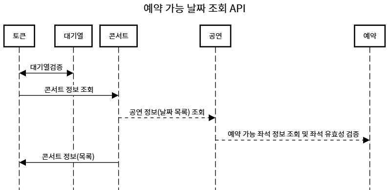
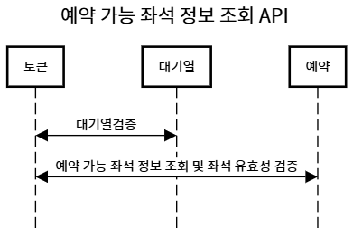
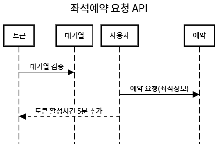
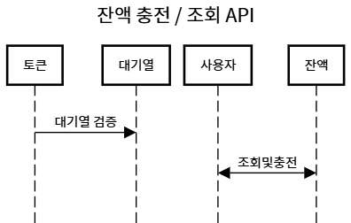
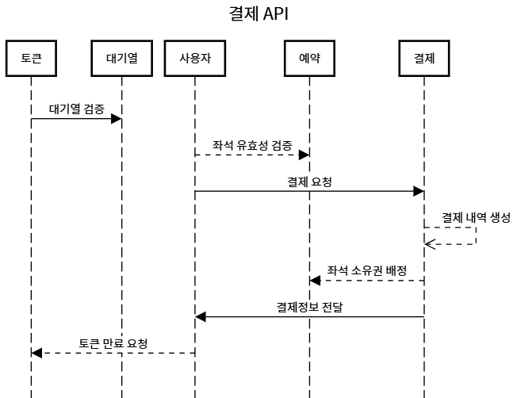

# 콘서트 예약 서비스 

## 1. 프로젝트 설계 

 Milestone, Flowchart, Sequence diagram

### Milestone
- [Milestone 문서 링크](https://docs.google.com/spreadsheets/d/1i9oEs6TZyc6xhpA1JSr8YnbOr1RjcxkH)

### Flowchart

### Sequence Diagram

#### 1. 예약가능날짜조회API 

    

#### 2. 예약가능좌석정보조회API 

    

#### 3. 좌석예약요청API 

    

####  4. 잔액충전및조회API 

    

####  5. 결제API 

    

