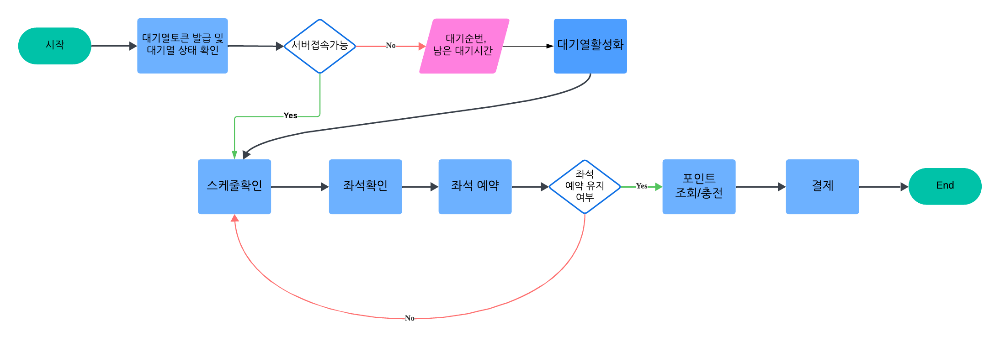

# 콘서트 예약 서비스 

## 1. 프로젝트 설계 

 Milestone, Flowchart, Sequence diagram

### Milestone
- [Milestone 문서 링크](https://docs.google.com/spreadsheets/d/1i9oEs6TZyc6xhpA1JSr8YnbOr1RjcxkH)

### Flowchart

### Sequence Diagram

#### 1. 예약가능날짜조회API 

    

#### 2. 예약가능좌석정보조회API 

    

#### 3. 좌석예약요청API 

    

####  4. 잔액충전및조회API 

    

####  5. 결제API 

    

## 2. ERD
- [ERD 링크](https://github.com/mybloom/hh_concert_java/issues/11)

## 3. API 명세서 
- [API 명세서 문서 링크](https://github.com/mybloom/hh_concert_java/issues/2)
- [Mock API 링크(로컬용)](http://localhost:8080/swagger-ui/index.html)

## 4. 프로젝트 회고
- [회고 문서 링크](https://devstep.tistory.com/133)

## 5. 동시성 제어 방식 레포트
- [동시성 제어 방식 레포트 링크](https://github.com/mybloom/hh_concert_java/wiki/Lock%EC%9D%84-%EC%9D%B4%EC%9A%A9%ED%95%9C-%EB%8F%99%EC%8B%9C%EC%84%B1-%EC%A0%9C%EC%96%B4-%EB%B0%A9%EC%8B%9D)